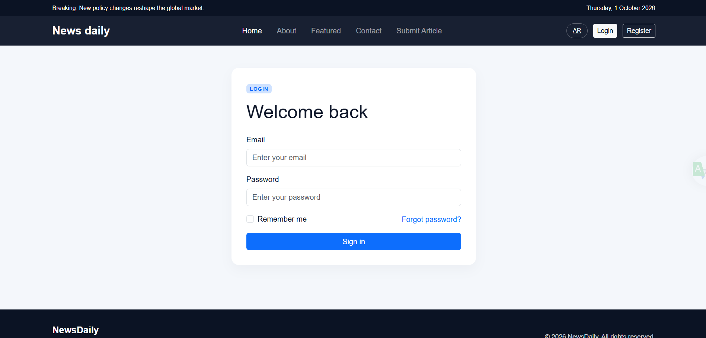
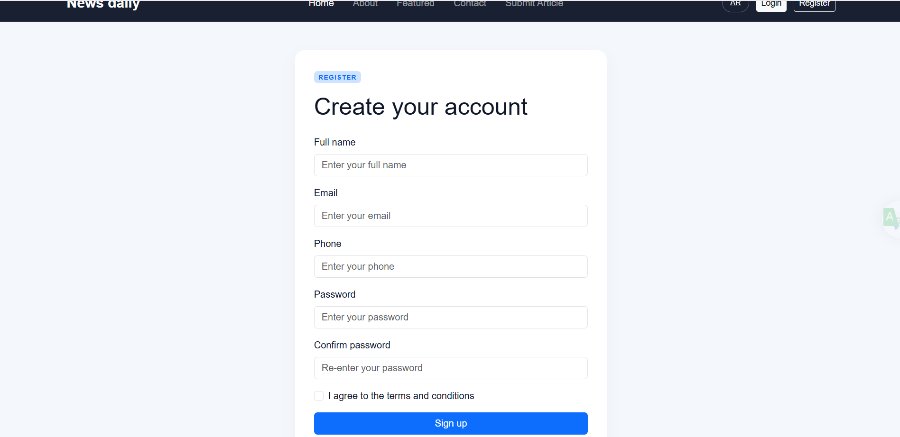
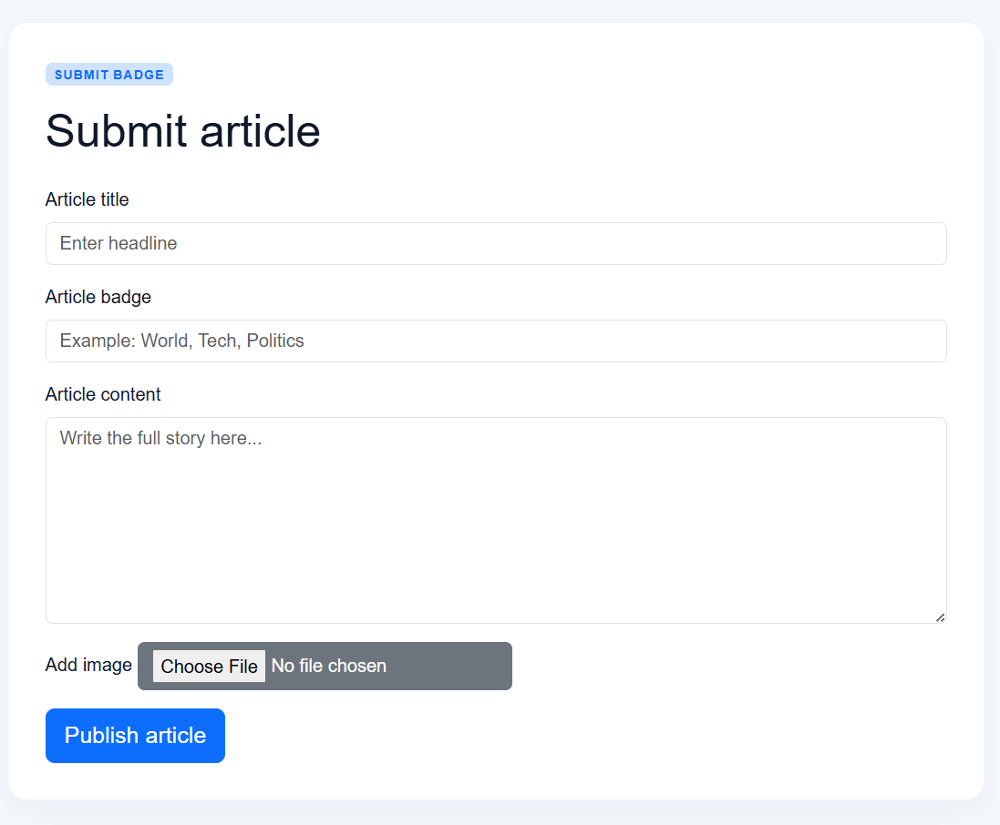
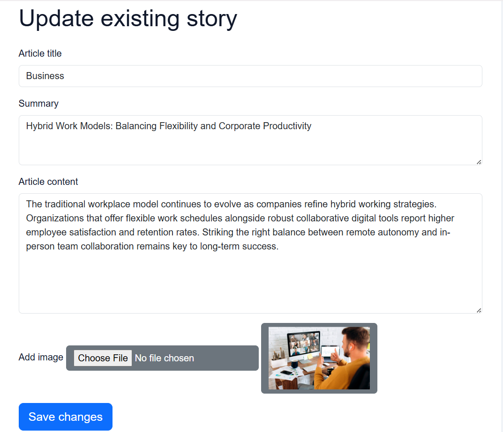

# NewsDaily

A simple news website built with PHP, MySQL, and Bootstrap. Browse articles, create an account, sign in, and publish articles with images.

## Features

- Browse articles and navigate between pages.
- Create an account and sign in.
- Publish articles and upload their images.
- Arabic and English language files.

## Requirements

- PHP with the `mysqli` extension.
- MySQL or MariaDB.
- A local server such as XAMPP, or hosting that supports PHP and MySQL.

## Run Locally with XAMPP

1. Copy the project into the `htdocs` folder.
2. Start Apache and MySQL from the XAMPP Control Panel.
3. Create a database named `site_news_project` in phpMyAdmin.
4. Import the tables from `db/queries.sql`. If the import fails, check the sample article inserts at the end of the file; there is an SQL syntax error in the row separators.
5. Update the database connection settings in `inc/connection.php` to match your MySQL configuration.
6. Open `http://localhost/your-project-folder/` in your browser.

Uploaded article images are stored in `assets/image/postImage/`. Make sure this folder exists and is writable by PHP.

## Screenshots

| Homepage                                     | Article page                                    |
| -------------------------------------------- | ----------------------------------------------- |
|  |  |

| Login page                                  | Registration page                                     |
| ------------------------------------------- | ----------------------------------------------------- |
|  |  |

| Add post page                                    | Update post page                                       |
| ------------------------------------------------ | ------------------------------------------------------ |
|  |  |

## Deployment

GitHub can store and share the project source code, but GitHub Pages does not run PHP or MySQL. To publish the website, upload the files to hosting that supports PHP and MySQL, create the database there, and update the connection settings in `inc/connection.php`. Do not commit real passwords or database credentials to a public repository.
